<h2 align="center">
    <a href="https://dainam.edu.vn/vi/khoa-cong-nghe-thong-tin">
    🎓 Faculty of Information Technology (DaiNam University)
    </a>
</h2>
<h2 align="center">
    XÂY DỰNG ỨNG DỤNG WEB QUẢN LÝ ĐẶT VÉ ONLINE
</h2>
<div align="center">
    <p align="center">
        
        
        
    </p>

[](https://www.facebook.com/DNUAIoTLab)
[](https://dainam.edu.vn/vi/khoa-cong-nghe-thong-tin)
[](https://dainam.edu.vn)

</div>
 
## 📖 1. Giới thiệu
Hệ thống Đặt vé Xem phim Trực tuyến được phát triển như một Bài tập lớn (BTL) môn học Phát triển mã nguồn mở tại Khoa Công nghệ Thông tin, *Đại học Đại Nam*.

Hệ thống cung cấp giải pháp toàn diện để quản lý các nghiệp vụ của rạp chiếu phim và cho phép khách hàng thực hiện việc đặt vé online một cách tiện lợi.

*`Các chức năng chính:`*
- Dành cho `Khách hàng` (Client): Xem thông tin phim, suất chiếu, chọn ghế trực quan, đặt vé.

- Dành cho `Quản trị viên` (Admin):

  - Quản lý Phim, Suất chiếu, Phòng chiếu và Sơ đồ ghế.

  - Quản lý Người dùng và Đơn đặt vé.

## 🔧 2. Các công nghệ được sử dụng
<div align="center">

### Hệ điều hành

[](https://www.microsoft.com/en-us/windows/)
[](https://ubuntu.com/)

### Công nghệ chính
[](https://www.php.net/)
[](#)
[](#)
[](#)
[](#)
[](https://getbootstrap.com/)

### Web Server & Database
[](https://httpd.apache.org/)
[](https://www.mysql.com/) 
[](https://www.apachefriends.org/)

### Database Management Tools
[](https://dev.mysql.com/downloads/workbench/)
</div>

## 🚀 3. Hình ảnh các chức năng
### Trang Chính
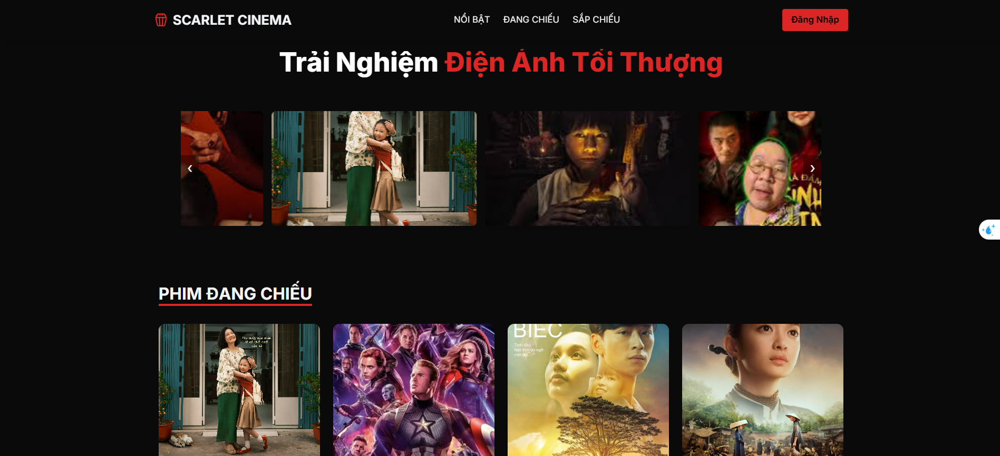

### Trang Đăng Nhập
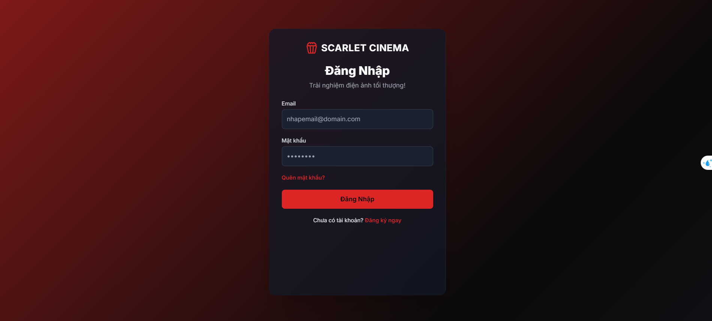

### Trang Đăng Ký
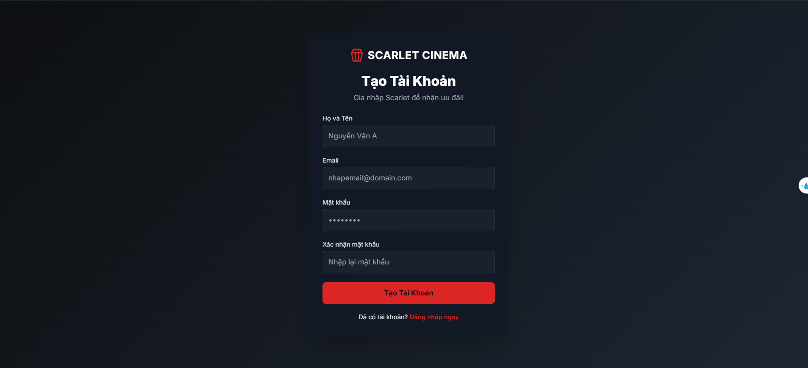

### Trang Project


### Trang Lịch sử mua vé
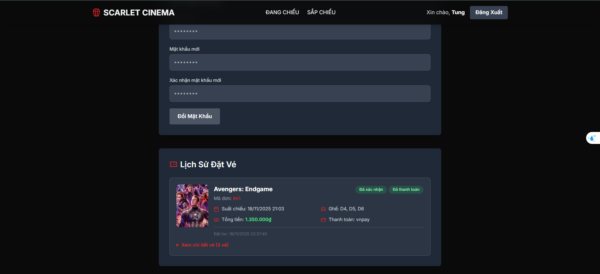

### Trang Admin Tổng quan
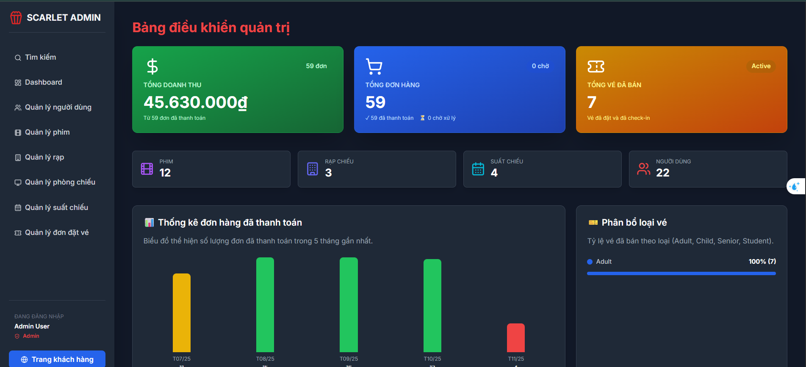

### Trang Admin người dùng
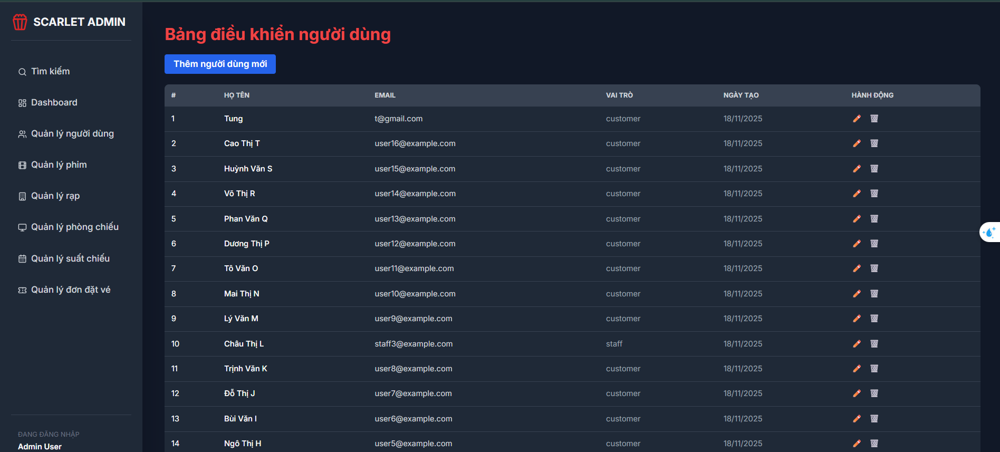

### Trang Admin quản lý phim
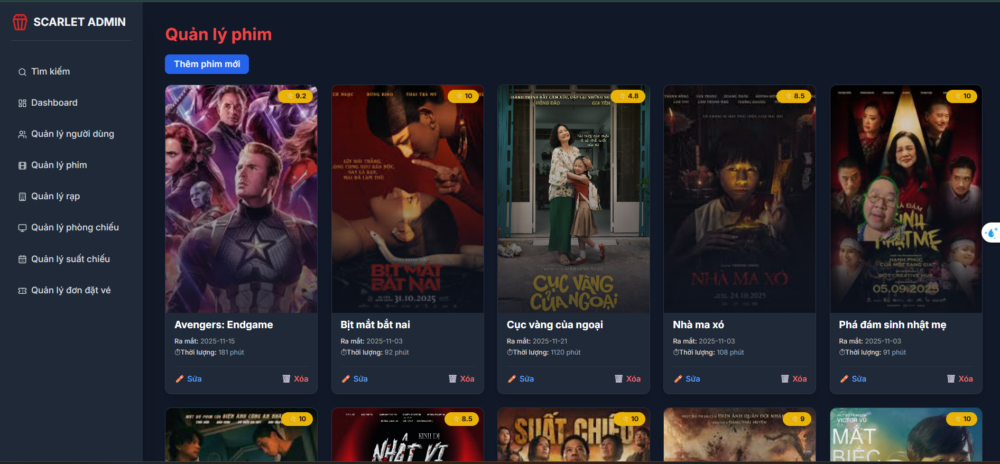

### Trang Admin rạp chiếu phỉm
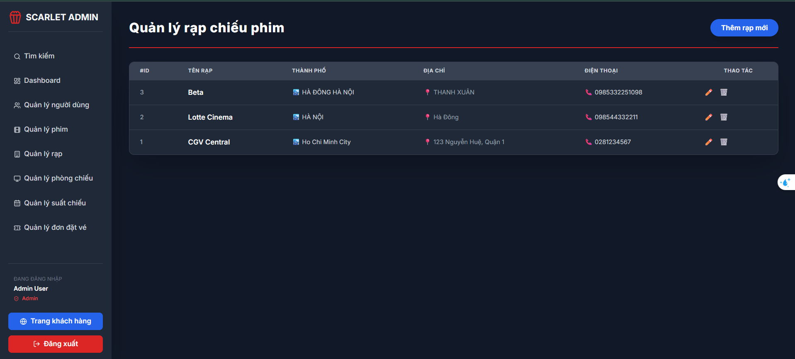

### Trang Admin Phòng chiếu phỉm
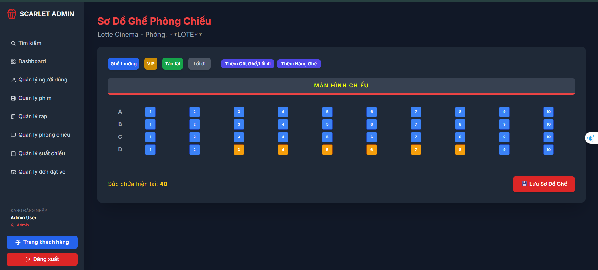

### Trang Admin đặt vé
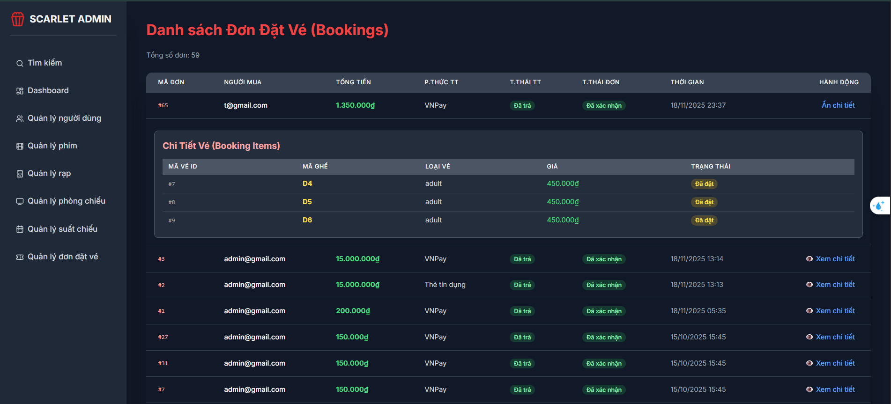

### Trang Admin tìm kiếm
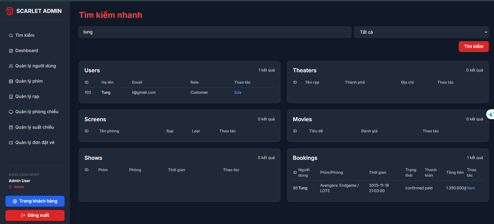


## ⚙️ 4. Cài đặt

### 4.1. Cài đặt công cụ, môi trường và các thư viện cần thiết

- Tải và cài đặt **XAMPP**  
  👉 https://www.apachefriends.org/download.html  
  (Khuyến nghị bản XAMPP với PHP 8.x)

- Cài đặt **Visual Studio Code** và các extension:
  - PHP Intelephense  
  - MySQL  
  - Prettier – Code Formatter  
### 4.2. Tải project
Clone project về thư mục `htdocs` của XAMPP (ví dụ ổ C):
-Bước 1: Truy cập vào:
```bash
cd C:\xampp\htdocs
```
-Bước2:
```bash
git clone https://github.com/nguyenthanhtung2k4/BTL_Book-movie-tickets.git
```
### 4.3. Setup database
Mở XAMPP Control Panel, Start Apache và MySQL

- Truy cập MySQL WorkBench
  - Chạy file `cinema.sql` để tạo  ra các bảng trong sql nhé!

### 4.4. Cấu trúc follder: 
```
asset/
│── css/
│── img/
│── js/
function/
│── auth.php      ← (Cần tạo file này)
│── db.php
handle/
documnets/
views/
│── admin/
│   ├── footer.php
│   ├── fromt.php   ← (Là format cấu trúc xây dựng )
│   ├── header.php
│   ├── index.php
│   ├── side_bar.php
│   ├── users.php
│   ├── ...
│── clinet/
│   ├── index.php
│   ├── ...
README.md

```

### 4.5. Setup tham số kết nối
- TẠO FILE `db.php` trong thư mục `function` và thiết lập kết nối nhé!

```PHP
<?php
class Database {
    private $host = 'localhost';
    private $db_name = 'cinema';
    private $username = 'root';

    private $password = '';

    private $port = '3306';
    private $conn;

    public function connect() {
        $this->conn = null;
        try {
            $this->conn = new PDO(
                 "mysql:host={$this->host};port={$this->port};dbname={$this->db_name};charset=utf8",
                $this->username,
                $this->password,
            );
            $this->conn->setAttribute(PDO::ATTR_ERRMODE, PDO::ERRMODE_EXCEPTION);
        } catch(PDOException $e) {
            die("Database connection failed: " . $e->getMessage());
        }
        return $this->conn;
    }
}
```
### 4.6. Chạy hệ thống

- Mở XAMPP Control Panel → Start Apache và MySQL

- Truy cập hệ thống:
👉 http://localhost/index.php

### 4.6. Đăng nhập lần đầu
Hệ thống có thể cấp tài khoản admin 

Sau khi đăng nhập Admin có thể:

Tạo thông tin liên quan

## Báo cáo & phân tích nghiệp vụ
Chúng tôi đã làm chi tiết bài báo cáo và phân tích chi tiết thông tin [Tại đây](./BTL_Mã%20Nguồn%20mở.docx)
